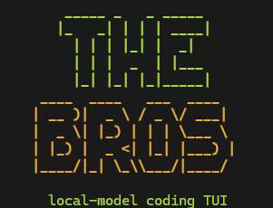

# LiL BRO

<p align="center">
  
</p>

**A model-agnostic AI coding assistant that lives on your machine.** No required API keys. No cloud billing. Just you, your GPU, and two bros who won't stop arguing.

LiL BRO is a dual-agent TUI (terminal user interface) that runs two AI coding assistants side by side. Each bro can be powered by a different backend — local Ollama, Claude Code CLI, or Codex CLI — and you can mix and match however you want.

- **Big Bro** — the coder. Reads, writes, and edits your files. Runs commands. Gets things done.
- **Lil Bro** — the helper. Read-only by default. Explains code, debugs logic, teaches concepts.

They share a workspace, they know about each other's moves via a live `SESSION.md` log, and they will absolutely talk trash when the other one is idle.


> **LiL BRO is in beta.** Expect rough edges and the occasional bro meltdown. We're building in public and moving fast — feedback and bug reports welcome.

> **Platform note:** LiL BRO runs on **Windows, macOS, and Linux**. Apple Silicon (M1/M2/M3/M4) is fully supported — Ollama runs natively on Metal and the bros detect your unified memory automatically.

---

## Two Modes

### 🖥️ Local Mode — free, private, offline
Run both bros on your own GPU using [Ollama](https://ollama.com). No accounts, no internet, no billing. Everything stays on your machine.

```
Big Bro: Ollama (qwen2.5-coder:7b)
Lil Bro: Ollama (qwen2.5-coder:7b)
```

Recommended for: daily use, private codebases, offline environments, low-cost setups.

### ☁️ Cloud Mode — use your existing Claude or Codex subscription
Power the bros with Claude Code CLI or Codex CLI using your existing **Claude Max/Pro** or **ChatGPT Plus/Pro** subscription. No new API keys — LIL BRO drives the same CLI tools you already use.

```
Big Bro: Claude Code CLI  (claude-opus-4 or sonnet)
Lil Bro: Codex CLI        (gpt-4o or gpt-4.1)
```

Or mix it:
```
Big Bro: Claude   ← heavy lifting, file edits, long context
Lil Bro: Ollama   ← fast local explanations, no cost
```

Recommended for: complex codebases, long-context work, when local VRAM is limited.

> **No new subscriptions required.** Cloud Mode works with the `claude` and `codex` CLI tools. If you already have Claude Max or ChatGPT Plus, you're set. LIL BRO wraps those CLIs — it doesn't call the API directly and doesn't add to your bill beyond your existing plan usage.

---

## How It Works

```
 YOU
  |
  v
[Input Bar] --Tab--> switches between Big Bro / Lil Bro
  |
  +---> Big Bro  ---> [Backend: Ollama | Claude | Codex]
  |                   tools: read/write/edit/grep/run
  |
  +---> Lil Bro  ---> [Backend: Ollama | Claude | Codex | FLEX]
                      tools: read-only (or write via /bunkbed)
```

Both bros talk to the same shared `SESSION.md` log so each can see what the other is doing — live, across all backends. You port context between them with Ctrl+B / Ctrl+C.

---

## Backends

LiL BRO is **model-agnostic**. Each bro is assigned its own backend independently. All three backends are subscription-based (no API keys required).

| Backend | How | Requirement |
|---------|-----|-------------|
| **Ollama** | Local HTTP streaming | Ollama installed |
| **Claude Code CLI** | `claude` subprocess, stream-json mode | Claude Max / Pro subscription |
| **Codex CLI** | `codex` subprocess, JSON-RPC 2.0 | ChatGPT Plus / Pro subscription |

Set backends in `config.yaml`:

```yaml
# Shorthand
big_bro: claude/claude-sonnet-4-5
lil_bro: ollama/qwen2.5-coder:7b

# Long form
big_bro:
  backend: claude
  model: claude-opus-4-7
lil_bro:
  backend: codex
  model: gpt-4o
```

Or use `/model big <name>` / `/model lil <name>` to switch live.

---

## Features

### Dual-Agent Layout
Two panes, two personalities. Tab between them. Ask Big Bro to write code, ask Lil Bro to explain it. They work on the same project simultaneously. Big Bro's text streams in **orange**, Lil Bro's in **green** — you always know who's talking.

### Live Tool Call Feed
When a bro is working, every tool call appears as a **collapsible yellow entry** — collapsed shows a short summary, click to expand for full detail:
- `Read` → shows the file contents
- `Edit` → shows the unified diff (before/after)
- `Bash` → shows the shell command
- `Write` → shows the full file being written

No more guessing what the model is doing. Watch it happen.

### Multi-Backend Support
Each bro runs its own backend independently. Mix and match:

```
Big Bro: Claude Code CLI  →  writes code, runs tests, edits files
Lil Bro: Ollama local     →  explains logic, reviews diffs, teaches
```

### Memory System
LIL BRO remembers. Everything accumulates into a local vector store (Chroma, optional) and a preference log:

- Past sessions are summarized and stored on shutdown
- `/recall <query>` does semantic search over everything you've ever worked on
- `/prefs` surfaces your coding patterns ("you always reach for dataclasses here")
- Memory gets injected into prompts automatically when relevant

### Living Roadmap
The killer feature. LIL BRO doesn't just answer questions — it helps you ship:

```
BRAINSTORM → GOAL LOCK → PLAN → EXECUTE → ROADMAP
```

1. `/brainstorm <goal>` — structured 6-section breakdown with Lil Bro
2. `/milestone <title>` — lock the goal as a milestone
3. `/plan-tasks <mid>` — Big Bro breaks it into concrete tasks
4. `/execute` — walks task by task, shows scope brief before each, you approve
5. `/icebox <idea>` — capture ideas mid-flow without breaking momentum

Roadmap persists at `~/.lilbro-local/roadmap.json` and is always live.

### Persona System
Three advisory voices active on every interaction — not modes, persistent lenses:

| Persona | Owns | Tone | Activates when |
|---------|------|------|----------------|
| 👩 MOM | Organization, accountability, momentum | Warm, persistent | Planning, roadmap drift, long sessions |
| 👨 DAD | Execution, efficiency, hard truths | Terse, direct | Task execution, scope creep, tech calls |
| 👵 GRANDMA | Memory, patterns, big picture | Patient, long-view | Brainstorm, teaching, repeated mistakes |

Address them directly: `/mom`, `/dad`, `/grandma` — or lock one with `/persona`.

### Adaptive Teaching Mode
`/lesson <topic>` doesn't give everyone the same explanation. The difficulty engine scores your familiarity from:
- Preference log events (learned / used signals)
- Memory store hits
- Skill level from your RPG profile

Then routes to the best available backend (Claude > Codex > Ollama) and delivers a structured lesson at the right level. Grandma's voice is always prefixed.

### Character Sheet
`/sheet` surfaces your RPG profile anywhere — level, XP, skills sorted by level, badges earned.

### PWA — Phone Access
`/pwa start` spins up a local web server. Open `http://<tailscale-ip>:8765/` on your phone to get a mobile-optimized view of your roadmap, memories, preferences, and icebox — all auto-refreshing. Install to home screen for a native-app feel. Uses stdlib only, zero extra deps.

Push notifications via ntfy.sh: `/notify <message>` sends to your phone instantly, no account required.

### Session Continuity (Claude / Codex)
Claude and Codex backends maintain persistent session context. Every connection prints a short session tag like `[abc12345]`. Resume with:

```
/resume abc12345         — resumes in Big Bro on next /restart
/resume lil cafe5678     — resumes in Lil Bro
```

Working in a registered project? Session is auto-saved and auto-resumed on next launch. Start fresh anytime with `/reset`.

### Grandpa (Knowledge Base)
Both bros have access to **Grandpa** — a local knowledge base with two bibles:

- **Coding Bible** — API docs, syntax references, stdlib patterns, code examples
- **Reasoning Bible** — debugging strategies, algorithm analysis, design tradeoffs

Grandpa uses **hybrid retrieval**: keyword pre-scan + model lookup, merged with confidence scoring.

> Grandpa is Ollama-only. Claude and Codex backends already carry that knowledge.

### Shared Workspace Log (SESSION.md)
Every backend reads and writes the same `SESSION.md` at your project root. Append-only breadcrumbs — user prompts, agent replies, tool calls, file edits. Each bro can see what the other is doing across all backends, passively.

### Clipboard Screenshot Paste
**Ctrl+Shift+V** pastes a screenshot directly from your clipboard. No manual file saving.

### BYOM — Bring Your Own Model
Any model Ollama can run works. Context windows calculated dynamically from architecture. GGUF imports and custom fine-tunes supported.

### Bro Bickering
The bros have personality — YERRR intros, working phrases, roasts when the other is idle, notifications when one is struggling.

### Bunkbed Mode
Lil Bro is read-only by default. `/bunkbed` gives him full write access. Run again to lock back down.

### RPG / Progression System
Optional gamification: XP, badges, quest system, campaign map with skill areas. Can be ignored entirely.

---

## Quick Start

### Requirements
- Python 3.11+
- 8GB+ RAM (16GB recommended)
- GPU with 6GB+ VRAM for 7b model (or CPU-only with 3b)
- [Ollama](https://ollama.com) installed (for local backend)

### Install Ollama

**Windows:**
```bash
winget install Ollama.Ollama
```

**macOS:**
```bash
brew install ollama
```

**Linux:**
```bash
curl -fsSL https://ollama.ai/install.sh | sh
```

### Install LiL BRO

```bash
# Clone the repo
git clone https://github.com/StoveGodCooks/LIL-BRO.git
cd LIL-BRO

# Install
pip install -e .

# Start (first run launches setup wizard)
lilbro-local
```

The setup wizard will:
1. Detect your hardware (GPU, VRAM, RAM)
2. Ask which mode: local (Ollama), cloud (Claude/Codex), or flex
3. For local: check Ollama, let you pick and pull a model
4. For cloud: detect CLI installations, guide installs if missing
5. Launch the dual-pane interface

### Models

**Ollama — recommended for local use:**

| Model | VRAM | Speed | Notes |
|-------|------|-------|-------|
| `qwen2.5-coder:7b` | ~5-6 GB | Medium | ⭐ Recommended default |
| `qwen2.5-coder:14b` | ~9-10 GB | Slower | Best local quality |
| `qwen2.5-coder:3b` | ~2-3 GB | Fast | Lightweight option |
| `deepseek-coder-v2` | ~9 GB | Medium | Strong coder |
| `llama3.1:8b` | ~5-6 GB | Medium | Good general + tools |

**Claude Code CLI — requires Claude Max/Pro:**
```
/model big claude-opus-4-7
/model big claude-sonnet-4-5
```

**Codex CLI — requires ChatGPT Plus/Pro:**
```
/model big gpt-4o
/model big gpt-4.1
```

---

## Slash Commands

```
/help                   — full help screen (also F1)
/settings               — open settings modal

--- Messages ---
/explain <topic>        — 6-section teaching breakdown (→ Lil Bro)
/plan <task>            — outline Goal/Steps/Files/Risks before coding (→ Big Bro)
/review                 — 4-section code review of Big Bro's last reply (→ Lil Bro)
/review-file <path>     — Lil Bro reads and reviews a specific file
/compare <a> | <b>      — structured compare/contrast teaching
/explain-diff           — teach through Big Bro's last reply
/trace <symbol>         — walk the call graph of a function/class
/debug <error>          — structured debug walkthrough

--- Models ---
/model                  — show current model for both bros
/model big <name>       — switch Big Bro's model (restarts agent)
/model lil <name>       — switch Lil Bro's model (restarts agent)
/models                 — list models available in Ollama

--- Session ---
/focus <task>           — pin a goal in the status bar + journal
/focus                  — clear current focus
/resume <session_id>    — resume a specific Claude/Codex session on next restart
/resume big|lil <id>    — target a specific bro
/reset                  — fresh session — clears threads, removes project sessions
/save [name]            — save the session journal
/load                   — list 10 most recent journals
/history clear          — clear conversation history (keep system prompt)

--- Sessions / Projects ---
/session-save <name>    — bookmark current project dir as a named session
/session-open <name>    — show info for a saved session
/sessions               — list all saved sessions

--- Memory ---
/remember <note>        — store a manual memory entry
/recall <query>         — semantic search over past memories
/memories [n]           — list n most recent memory entries
/forget <query>         — delete memories and preferences matching query
/prefs [n]              — show top observed preference patterns

--- Roadmap ---
/roadmap                — render the living roadmap
/brainstorm <goal>      — structured 6-section brainstorm (→ Lil Bro)
/milestone <title>      — add a new milestone
/milestone start <id>   — set milestone IN_PROGRESS
/milestone done <id>    — mark milestone COMPLETED
/milestone delete <id>  — remove a milestone
/plan-tasks <mid>       — Big Bro breaks milestone into tasks
/task list              — list all tasks
/task add <mid> <title> — add a task to a milestone
/task start             — mark next task IN_PROGRESS
/task done              — mark active task COMPLETED
/task block             — mark active task BLOCKED
/task delete <id>       — remove a task
/execute [mid]          — prep next BACKLOG task with scope brief
/icebox <idea>          — capture idea without interrupting flow
/icebox list            — list open icebox items
/icebox drop <id>       — drop an icebox item
/icebox promote <id> <mid> — promote idea to a milestone as a task

--- Personas ---
/mom                    — address Mom directly (organization, momentum)
/dad                    — address Dad directly (execution, efficiency)
/grandma                — address Grandma directly (memory, big picture)
/persona [mom|dad|grandma|auto] — lock or reset dominant persona
/sheet                  — show character sheet (level, XP, skills, badges)
/lesson <topic>         — adaptive lesson routed to best backend

--- PWA / Phone ---
/pwa start [port]       — start phone web server (default 8765)
/pwa stop               — stop the server
/pwa url                — show the current URL
/notify <message>       — push notification via ntfy.sh

--- Navigation ---
/cwd  /pwd              — show project directory
/journal                — show current journal file path
/session                — show live SESSION.md log (last 80 lines) · F2
/state                  — dump diagnostics (python, pids, models, paths)
/status                 — show Ollama connection status and model info

--- Tools ---
/wrap                   — toggle soft word-wrap on active panel
/clear                  — wipe active panel scrollback
/debug-dump             — bundle debug.log + SESSION.md + journal into a zip
/find <query>           — grep across saved journals for a substring
/export-html            — export current journal to styled HTML

--- Bro Controls ---
/bunkbed                — toggle Lil Bro write access (default: read-only)
/restart [a|b|both]     — force-restart an agent (bypasses cooldown)

--- Meta ---
/player                 — show RPG card (level, skills, badges, perks)
/skills                 — list installed skill plugins
/quit  /exit            — shut down THE BROS
```

---

## Keyboard Shortcuts

```
Tab              — switch active bro
Enter            — send message
Ctrl+C           — copy last response to clipboard
Ctrl+B           — port Big Bro's last message to Lil Bro
Ctrl+Shift+V     — paste clipboard screenshot as attachment
Ctrl+Q           — quit
F1               — help screen
F2               — SESSION.md viewer
F3               — multi-line compose
Alt+Left/Right   — resize panes
```

---

## Configuration

`~/.lilbro-local/config.yaml`:

```yaml
# Per-bro backend assignment
big_bro: claude/claude-sonnet-4-5   # or ollama/qwen2.5-coder:7b or codex/gpt-4o
lil_bro: ollama/qwen2.5-coder:7b

# Ollama settings (used when backend is ollama)
ollama:
  base_url: "http://127.0.0.1:11434"
  model: "qwen2.5-coder:7b"
  context_window_big: auto          # or integer e.g. 32768
  context_window_lil: auto
  temperature: 0.1

# Push notifications (ntfy.sh — no account required)
notify:
  topic: your-unique-topic-here     # or set $LILBRO_NTFY_TOPIC env var

# Colors
colors:
  primary: "#A8D840"
```

---

## Architecture

```
src_local/
  app.py              — main app, screen management, agent wiring
  router.py           — routes user input to active agent or command handler
  config.py           — YAML config loader (per-bro backend schema)
  personas.py         — Mom / Dad / Grandma classifier and persona system

  agents/
    base.py           — AgentProcess base class (lifecycle, heartbeat, cancel, RSS)
    connectors.py     — CONNECTORS registry + build_agent() factory
    ollama_agent.py   — Ollama: HTTP streaming, tool loop, hybrid retrieval
    claude_agent.py   — Claude Code CLI: stream-json subprocess, session persistence
    codex_agent.py    — Codex CLI: JSON-RPC 2.0, MCP server, threadId management
    cloud_install.py  — CLI detection + guided install for Claude / Codex
    tools.py          — tool schemas + executors (read/write/edit/run/grep/bible)
    phrases.py        — personality text (intros, working phrases, roasts)
    ollama_install.py — Ollama detection, install, model pulling
    hardware.py       — GPU/VRAM/RAM detection

  bibles/
    store.py          — bible retrieval engine (tag-scored lookup)
    coding.bible.json — coding knowledge base
    reasoning.bible.json — reasoning knowledge base

  commands/
    handler.py        — slash command parser and executor

  memory/
    chroma_store.py   — local Chroma vector DB wrapper (optional dep, graceful no-op)
    preference_log.py — preference event log (JSON, capped at 2000 events)
    project_registry.py — register and track projects
    session_summarizer.py — summarize sessions via local model
    context_injector.py — inject relevant memory into prompts

  roadmap/
    living_map.py     — milestones + tasks + states, JSON persisted
    icebox.py         — append-only idea capture with promote/drop lifecycle
    brainstorm.py     — structured 6-section brainstorm prompt builder
    planner.py        — milestone → tasks prompt + bullet-list parser
    executor.py       — task-by-task walker with user-approval briefings

  teaching/
    adaptive.py       — DifficultyEngine: scores topic familiarity, emits tier
    delivery.py       — backend router + lesson prompt builder
    character_sheet.py — compact level/XP/skills/badges renderer

  pwa/
    server.py         — stdlib HTTPServer in daemon thread, JSON API endpoints
    notify.py         — ntfy.sh push notification wrapper
    static/           — index.html, style.css, app.js, manifest, service-worker

  ui/
    panels.py         — Big Bro / Lil Bro panels (VerticalScroll + Collapsible)
    app.tcss          — Textual CSS theme
    input_bar.py      — input bar, target switching, clipboard paste
    commands_meta.py  — single source of truth for all slash command metadata
    first_run.py      — setup wizard (local / cloud / flex mode selection)
    settings_screen.py — settings modal
    status_bar.py     — bottom status bar
    command_palette.py — inline slash command picker
    help_screen.py    — full help modal
    ...               — compose, search, project switcher, campaign map screens

  journal/            — session logging and HTML export
  rpg/                — XP, badges, skills, challenges (optional)
  quests/             — quest content and state (optional)
```

---

## Roadmap

| Phase | Name | Status |
|-------|------|--------|
| 0 | Foundation (Ollama, tools, RPG, quests, journal) | ✅ Done |
| 1 | Connector Layer (Claude, Codex, multi-backend, FLEX) | ✅ Done |
| 2 | Memory System (vector DB, preference log, /recall) | ✅ Done |
| 3 | Roadmap Engine (brainstorm → plan → execute loop) | ✅ Done |
| 4 | Persona System (Mom / Dad / Grandma advisory layer) | ✅ Done |
| 5 | Teaching Mode++ (adaptive difficulty, memory-aware) | ✅ Done |
| 6 | PWA + Phone (Tailscale, ntfy.sh, mobile roadmap) | ✅ Done |

---

## License

MIT
